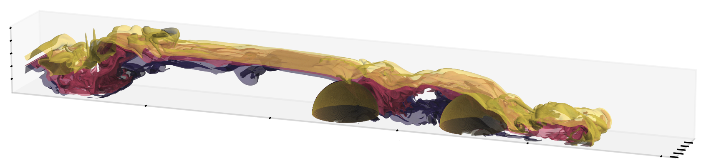
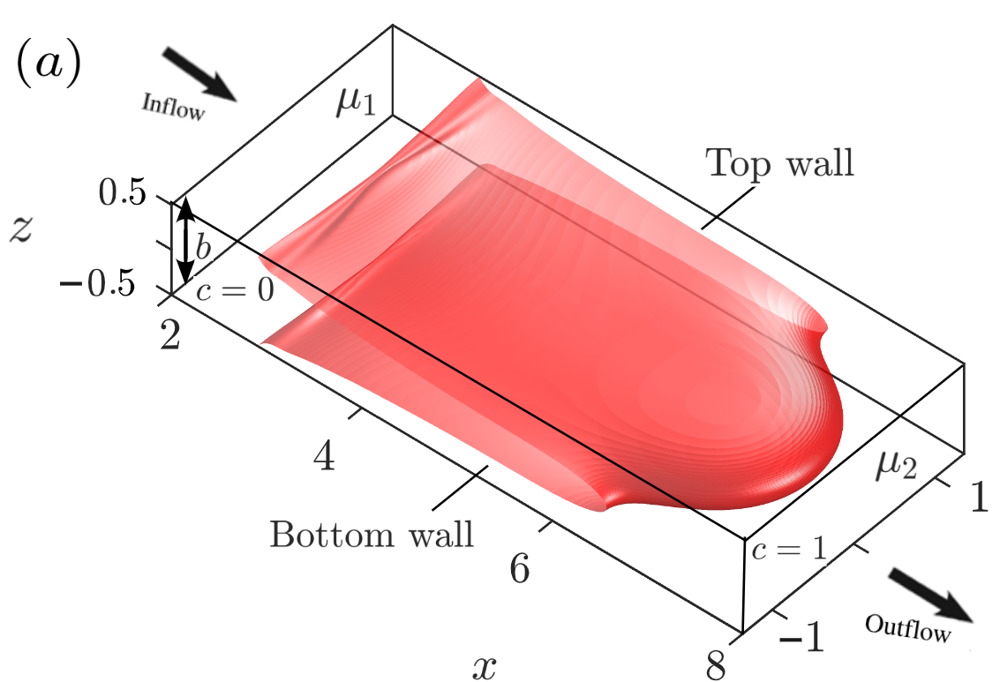
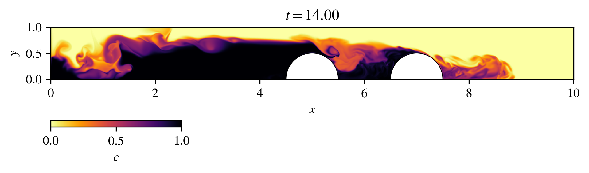

# Pedro H. A. Anjos

::: {.columns}

::: {.column width="25%"}

{width=180px}

:::

::: {.column width="75%"}

## Computational Physicist

*Multiphase Flows • Environmental Flows • Scientific Computing*

I develop computational models and high-fidelity numerical simulations to study multiphase flows, particle-laden transport, and evolving fluid interfaces in environmental and engineering systems.

My research combines fluid mechanics, applied mathematics, and scientific computing to investigate problems ranging from porous media displacement and interfacial instabilities to gravity currents and sediment transport.

:::

:::

{fig-align="center" width="100%"}

## Research Areas

::: {.columns}

::: {.column width="50%"}

### Multiphase Flows and Transport

Displacement processes, miscible and immiscible flows, porous media transport, and flow control.

:::

::: {.column width="50%"}

### Environmental and Geophysical Flows

Turbidity currents, gravity currents, sediment transport, and particle-laden flows.

:::

:::

::: {.columns}

::: {.column width="50%"}

### Interfacial Dynamics

Hydrodynamic instabilities, evolving interfaces, and pattern formation.

:::

::: {.column width="50%"}

### Computational Methods

Scientific computing, Navier–Stokes solvers, boundary integral methods, and HPC.

:::

:::