# Publications

## Preprints & Submitted

::: {.columns}

::: {.column width="80%"}

<strong><a href=" " target="_blank">24. Three-dimensional simulations of variable-viscosity gravity currents</a></strong>   
**Pedro H. A. Anjos**, Eckart Meiburg, and Rafael M. Oliveira    
Submitted

:::

::: {.column width="20%"}

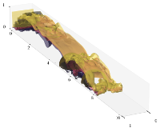{fig-align="right" width="70%"}

:::

:::

::: {.columns}

::: {.column width="80%"}

<strong><a href=" " target="_blank">23. Interfacial properties and inertial effects in the growth of three-dimensional miscible viscous fingers with nonmonotonic viscosity profile</a></strong>   
Bruno J. M. Santos, **Pedro H. A. Anjos**, and Rafael M. Oliveira    
Submitted

:::

::: {.column width="20%"}

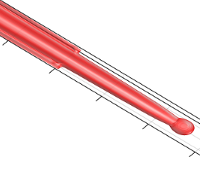{fig-align="right" width="70%"}

:::

:::

::: {.columns}

::: {.column width="80%"}

<strong><a href=" " target="_blank">22. Optimizing injection protocols in Hele-Shaw displacements: a trade-off between swept area and injection time</a></strong>   
Anna L. M. B. Mattos, Rafael M. Oliveira, **Pedro H. A. Anjos**, and Eduardo O. Dias    
Submitted

:::

::: {.column width="20%"}

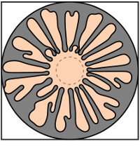{fig-align="right" width="70%"}

:::

:::

## Published

### 2026

### 2025

::: {.columns}

::: {.column width="80%"}

<strong><a href="https://pubs.aip.org/aip/pof/article-abstract/37/8/082108/3357894/Ferrofluid-drop-in-an-off-centered-radial-magnetic?redirectedFrom=fulltext" target="_blank">21. Ferrofluid drop in an off-centered radial magnetic field</a></strong>    
Írio M. Coutinho, **Pedro H. A. Anjos**, Rafael M. Oliveira, and José A. Miranda    
Phys. Fluids 37, 082108 (2025)

:::

::: {.column width="20%"}

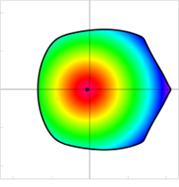{fig-align="right" width="70%"}

:::

:::

### 2024

::: {.columns}

::: {.column width="80%"}

<strong><a href="https://journals.aps.org/pre/abstract/10.1103/PhysRevE.109.015104" target="_blank">20. Fingering stabilization and adhesion force in the lifting flow with a fluid annulus</a></strong>    
Írio M. Coutinho, **Pedro H. A. Anjos**, Rafael M. Oliveira, and José A. Miranda    
Phys. Rev. E 109, 015104 (2024)

:::

::: {.column width="20%"}

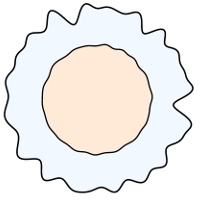{fig-align="right" width="70%"}

:::

:::

### 2023

::: {.columns}

::: {.column width="80%"}

<strong><a href="https://global-sci.org/intro/article_detail/cicp/21493.html" target="_blank">19. Numerical study on viscous fingering using electric fields in a Hele-Shaw cell</a></strong>    
Meng Zhao, **Pedro H. A. Anjos**, John Lowengrub, Wenjun Ying, and Shuwang Li    
Commun. Comput. Phys. 33, 399 (2023)

:::

::: {.column width="20%"}

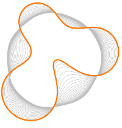{fig-align="right" width="70%"}

:::

:::

### 2022

::: {.columns}

::: {.column width="80%"}

<strong><a href="https://journals.aps.org/pre/abstract/10.1103/PhysRevE.106.055109" target="_blank">18. Controlling fluid adhesion force with electric fields</a></strong>    
**Pedro H. A. Anjos**, Francisco M. Rocha, and Eduardo O. Dias    
Phys. Rev. E 106, 055109 (2022)

:::

::: {.column width="20%"}

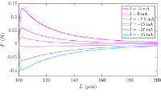{fig-align="right" width="70%"}

:::

:::

::: {.columns}

::: {.column width="80%"}

<strong><a href="https://journals.aps.org/prfluids/abstract/10.1103/PhysRevFluids.7.053903" target="_blank">17. Electrically controlled self-similar evolution of viscous fingering patterns</a></strong>    
**Pedro H. A. Anjos**, Meng Zhao, John Lowengrub, and Shuwang Li    
Phys. Rev. Fluids 7, 053903 (2022)

:::

::: {.column width="20%"}

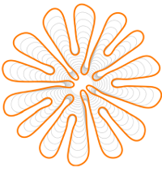{fig-align="right" width="70%"}

:::

:::

::: {.columns}

::: {.column width="80%"}

<strong><a href="https://journals.aps.org/pre/abstract/10.1103/PhysRevE.105.04510" target="_blank">16. Ferrofluid annulus in crossed magnetic fields</a></strong>    
Pedro O. S. Livera, **Pedro H. A. Anjos**, and José A. Miranda    
Phys. Rev. E 105, 045106 (2022)

:::

::: {.column width="20%"}

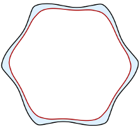{fig-align="right" width="70%"}

:::

:::

### 2021

::: {.columns}

::: {.column width="80%"}

<strong><a href="https://journals.aps.org/pre/abstract/10.1103/PhysRevE.104.065113" target="_blank">15. Shape instabilities in confined ferrofluids under crossed magnetic fields</a></strong>    
Rafael M. Oliveira, Írio M. Coutinho, **Pedro H. A. Anjos**, and José A. Miranda    
Phys. Rev. E 104, 065113 (2021)

:::

::: {.column width="20%"}

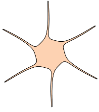{fig-align="right" width="70%"}

:::

:::

::: {.columns}

::: {.column width="80%"}

<strong><a href="https://journals.aps.org/pre/abstract/10.1103/PhysRevE.104.065103" target="_blank">14. Magnetically induced interfacial instabilities in a ferrofluid annulus</a></strong>    
Pedro O. S. Livera, **Pedro H. A. Anjos**, and José A. Miranda    
Phys. Rev. E 104, 065103 (2021)

:::

::: {.column width="20%"}

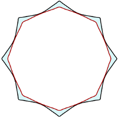{fig-align="right" width="70%"}

:::

:::

::: {.columns}

::: {.column width="80%"}

<strong><a href="https://journals.aps.org/pre/abstract/10.1103/PhysRevE.103.063105" target="_blank">13. Controlling fingering instabilities in Hele-Shaw flows in the presence of wetting film effects</a></strong>    
**Pedro H. A. Anjos**, Meng Zhao, John Lowengrub, Weizhu Bao, and Shuwang Li    
Phys. Rev. E 103, 063105 (2021)

:::

::: {.column width="20%"}

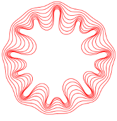{fig-align="right" width="70%"}

:::

:::

### 2020

::: {.columns}

::: {.column width="80%"}

<strong><a href="https://journals.aps.org/prfluids/abstract/10.1103/PhysRevFluids.5.124005" target="_blank">12. Pattern formation of the three-layer Saffman-Taylor problem in a radial Hele-Shaw cell</a></strong>    
Meng Zhao, **Pedro H. A. Anjos**, John Lowengrub, and Shuwang Li    
Phys. Rev. Fluids 5, 124005 (2020)

:::

::: {.column width="20%"}

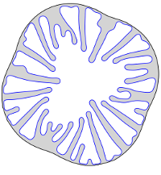{fig-align="right" width="70%"}

:::

:::

::: {.columns}

::: {.column width="80%"}

<strong><a href="https://journals.aps.org/prfluids/abstract/10.1103/PhysRevFluids.5.054002" target="_blank">11. Weakly nonlinear analysis of the Saffman-Taylor problem in a radially spreading fluid annulus</a></strong>    
**Pedro H. A. Anjos**, and Shuwang Li    
Phys. Rev. Fluids 5, 054002 (2020)

:::

::: {.column width="20%"}

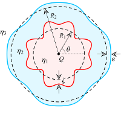{fig-align="right" width="70%"}

:::

:::

### 2019

::: {.columns}

::: {.column width="80%"}

<strong><a href="https://journals.aps.org/pre/abstract/10.1103/PhysRevE.99.022608" target="_blank">10. Wrinkling and folding patterns in a confined ferrofluid droplet with an elastic interface</a></strong>    
**Pedro H. A. Anjos**, Gabriel D. Carvalho, Sérgio A. Lira, and José A. Miranda    
Phys. Rev. E 99, 022608 (2019)

:::

::: {.column width="20%"}

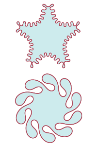{fig-align="right" width="70%"}

:::

:::

### 2018

::: {.columns}

::: {.column width="80%"}

<strong><a href="https://journals.aps.org/prfluids/abstract/10.1103/PhysRevFluids.3.124004" target="_blank">9. Fingering instability transition in radially tapered Hele-Shaw cells: Insights at the onset of nonlinear effects</a></strong>    
**Pedro H. A. Anjos**, Eduardo O. Dias, and José A. Miranda    
Phys. Rev. Fluids 3, 124004 (2018)

:::

::: {.column width="20%"}

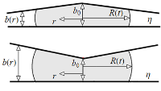{fig-align="right" width="70%"}

:::

:::

::: {.columns}

::: {.column width="80%"}

<strong><a href="https://journals.aps.org/prfluids/abstract/10.1103/PhysRevFluids.3.044002" target="_blank">8. Fingering patterns in magnetic fluids: Perturbative solutions and the stability of exact stationary shapes</a></strong>    
**Pedro H. A. Anjos**, Sérgio A. Lira, and José A. Miranda    
Phys. Rev. Fluids 3, 044002 (2018)

:::

::: {.column width="20%"}

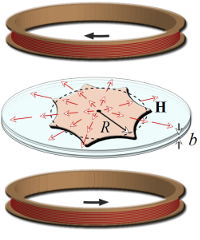{fig-align="right" width="70%"}

:::

:::

### 2017

::: {.columns}

::: {.column width="80%"}

<strong><a href="https://journals.aps.org/prfluids/abstract/10.1103/PhysRevFluids.2.124003" target="_blank">7. Rotating Hele-Shaw cell with a time-dependent angular velocity</a></strong>    
**Pedro H. A. Anjos**, Victor M. M. Alvarez, Eduardo O. Dias, and José A. Miranda    
Phys. Rev. Fluids 2, 124003 (2017)

:::

::: {.column width="20%"}

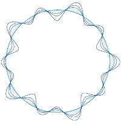{fig-align="right" width="70%"}

:::

:::

::: {.columns}

::: {.column width="80%"}

<strong><a href="https://journals.aps.org/prfluids/abstract/10.1103/PhysRevFluids.2.084004" target="_blank">6. Radial fingering under arbitrary viscosity and density ratios</a></strong>    
**Pedro H. A. Anjos**, Eduardo O. Dias, and José A. Miranda  
Phys. Rev. Fluids 2, 084004 (2017)

:::

::: {.column width="20%"}

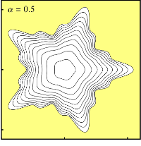{fig-align="right" width="70%"}

:::

:::

::: {.columns}

::: {.column width="80%"}

<strong><a href="https://journals.aps.org/prfluids/abstract/10.1103/PhysRevFluids.2.014003" target="_blank">5. Inertia-induced dendriticlike patterns in lifting Hele-Shaw flows</a></strong>    
**Pedro H. A. Anjos**, Eduardo O. Dias, and José A. Miranda  
Phys. Rev. Fluids 2, 014003 (2017)

:::

::: {.column width="20%"}

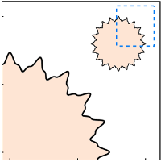{fig-align="right" width="70%"}

:::

:::

### 2015

::: {.columns}

::: {.column width="80%"}

<strong><a href="https://journals.aps.org/pre/abstract/10.1103/PhysRevE.92.043019" target="_blank">4. Kinetic undercooling in Hele-Shaw flows</a></strong>    
**Pedro H. A. Anjos**, Eduardo O. Dias, and José A. Miranda    
Phys. Rev. E 92, 043019 (2015)

:::

::: {.column width="20%"}

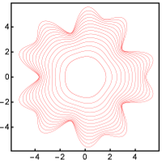{fig-align="right" width="70%"}

:::

:::

::: {.columns}

::: {.column width="80%"}

<strong><a href="https://journals.aps.org/pre/abstract/10.1103/PhysRevE.91.013003" target="_blank">3. Adhesion force in fluids: Effects of fingering, wetting, and viscous normal stresses</a></strong>  
**Pedro H. A. Anjos**, Eduardo O. Dias, Laércio Dias, and José A. Miranda   
Phys. Rev. E 91, 013003 (2015)

:::

::: {.column width="20%"}

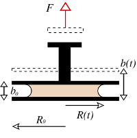{fig-align="right" width="70%"}

:::

:::

### 2014

::: {.columns}

::: {.column width="80%"}

<strong><a href="https://pubs.rsc.org/en/content/articlelanding/2014/sm/c4sm01047g/unauth" target="_blank">2. Influence of wetting on fingering patterns in lifting Hele-Shaw flows</a></strong>  
**Pedro H. A. Anjos**, and José A. Miranda  
Soft Matter 10, 7459 (2014)   
*(cover page article)*

:::

::: {.column width="20%"}

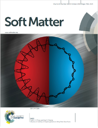{fig-align="right" width="70%"}

:::

:::

### 2013

::: {.columns}

::: {.column width="80%"}

<strong><a href="https://journals.aps.org/pre/abstract/10.1103/PhysRevE.88.053003" target="_blank">1. Radial viscous fingering: Wetting film effects on pattern-forming mechanisms</a></strong>  
**Pedro H. A. Anjos**, and José A. Miranda  
Phys. Rev. E 88, 053003 (2013)

:::

::: {.column width="20%"}

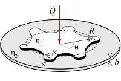{fig-align="right" width="70%"}

:::

:::

---
	
	